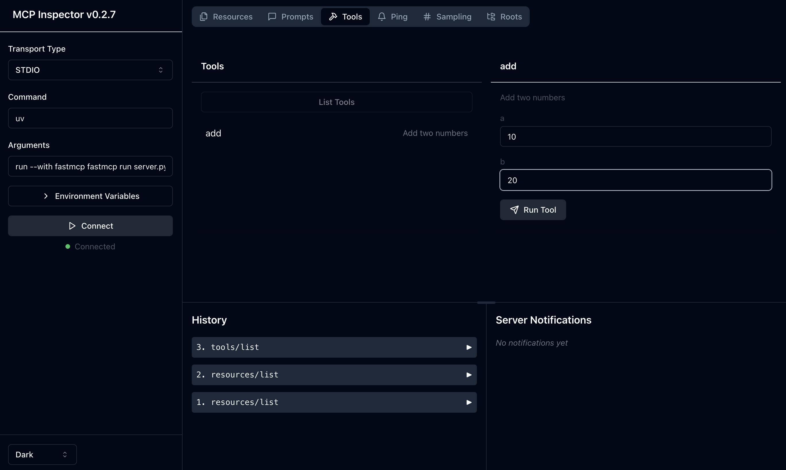
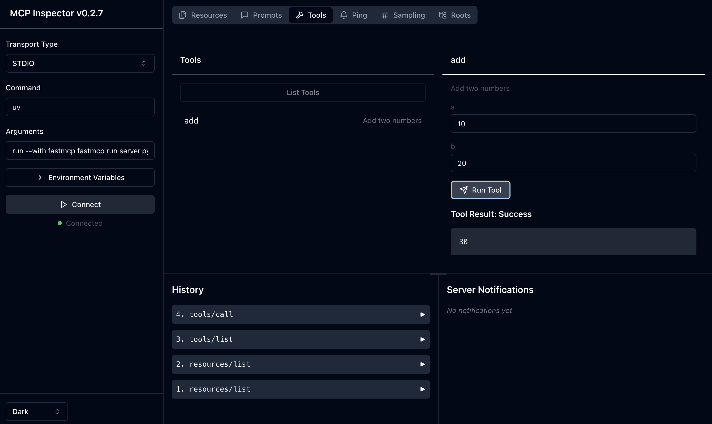
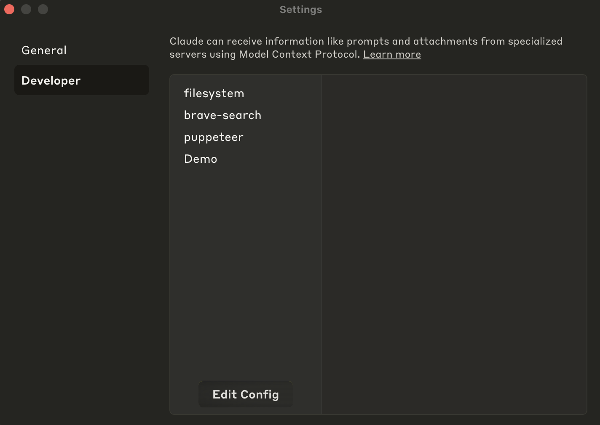
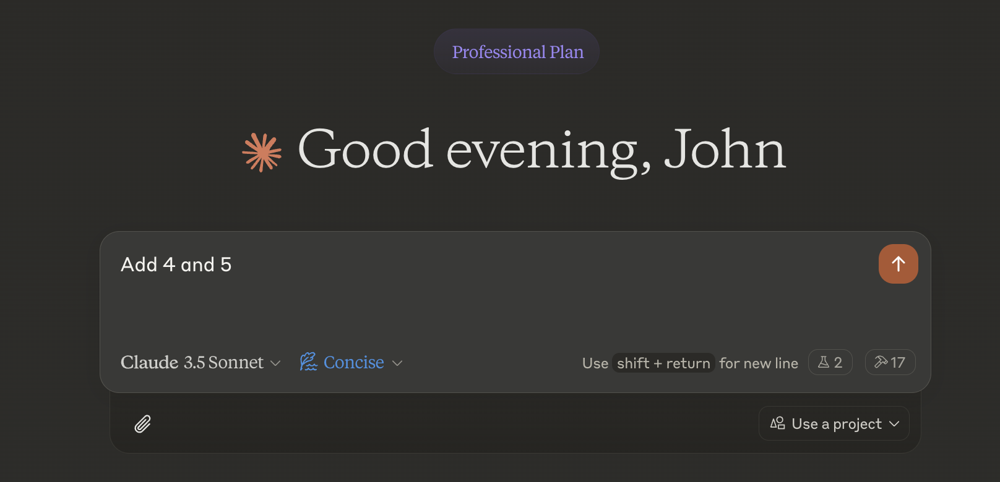
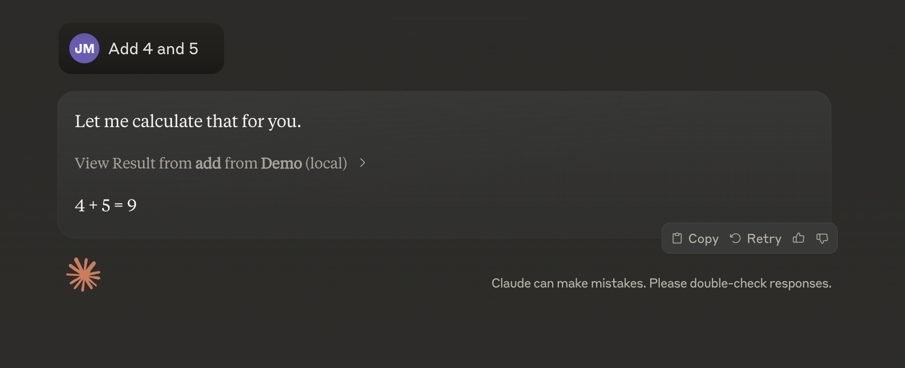

# Making a Claude MCP By Urself
 
I found this cool repo called [`fastmcp`](https://github.com/jlowin/fastmcp) and gave it a whirl after figuring out how to use Claude MCP [over here](https://medium.com/@johnmaeda/claude-mcp-first-run-be-sure-to-choose-settings-from-the-menubar-to-save-yourself-time-fa457ad37582?sk=a89112b80b573eb65c256a51683ebd21).

## Getting Started

```
brew install uv
uv pip install fastmcp
```

## Run the server in `server.py`

```
fastmcp install server.py
```

I had to run this:

```
uv pip install "pydantic>=2.0.0"
```

And I got back:

```
(base) ➜  claude-mcp-test git:(main) ✗ fastmcp install server.py       
[11/30/24 18:07:43] INFO     Added server 'Demo' to Claude config           claude.py:98
                    INFO     Successfully installed Demo in Claude app        cli.py:355
```

It can be tested with:

```
fastmcp dev server.py
```

You can then launch a server. Select 'connect' and then 'Tools' at the top menu.



I've entered the two parameters ... and it worked!



There's the issue of lots of errors pouring out into the console. But ... it seems to work. Let's now plug it in.

I proceeded to go ahead and run it:

```
fastmcp run server.py
```

Note that the "installation" only means it writes into the claude_desktop_config.json file. If you want to remove it, you should just edit the entry from the file:

```
    "Demo": {
      "command": "uv",
      "args": [
        "run",
        "--with",
        "fastmcp",
        "fastmcp",
        "run",
        "/Users/maeda/Documents/GitHub/claude-mcp-test/server.py"
      ]
    }
```

### Trying it out in Claude

So I quit Claude and restarted it. And then saw that the "Demo" server is connected.



I then proceeded to try it out. It HIL'd me to ask if I could use 'Demo' and I gave it permission.



It worked!



Not bad `fastmcp`!